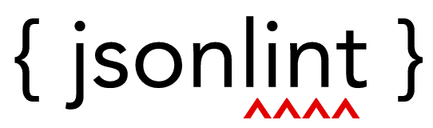
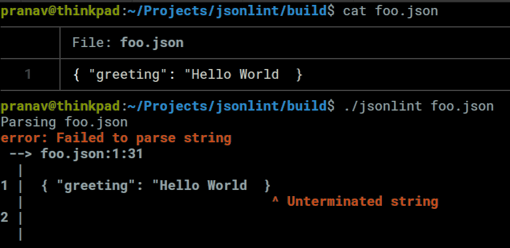
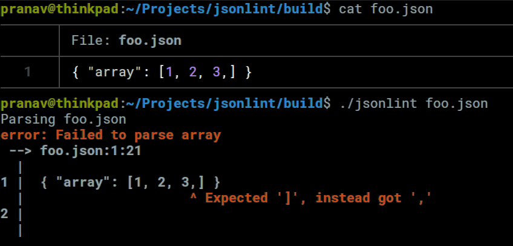
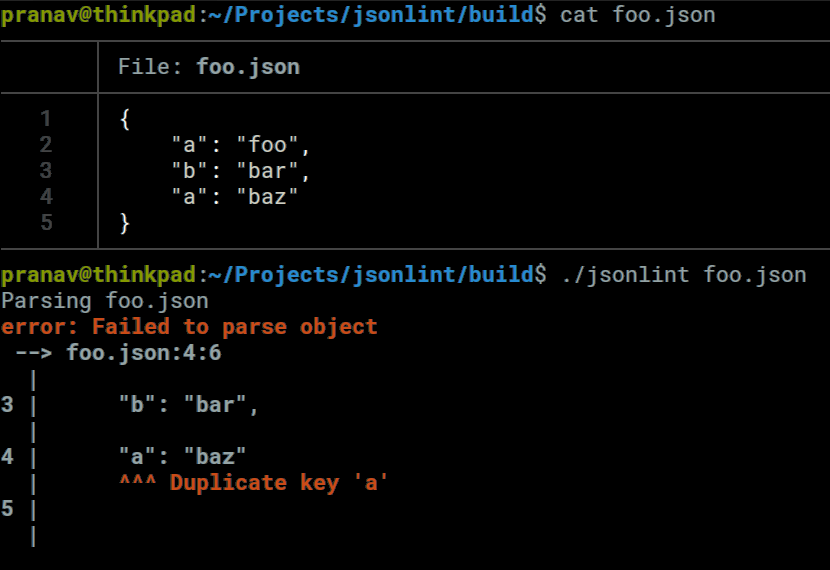
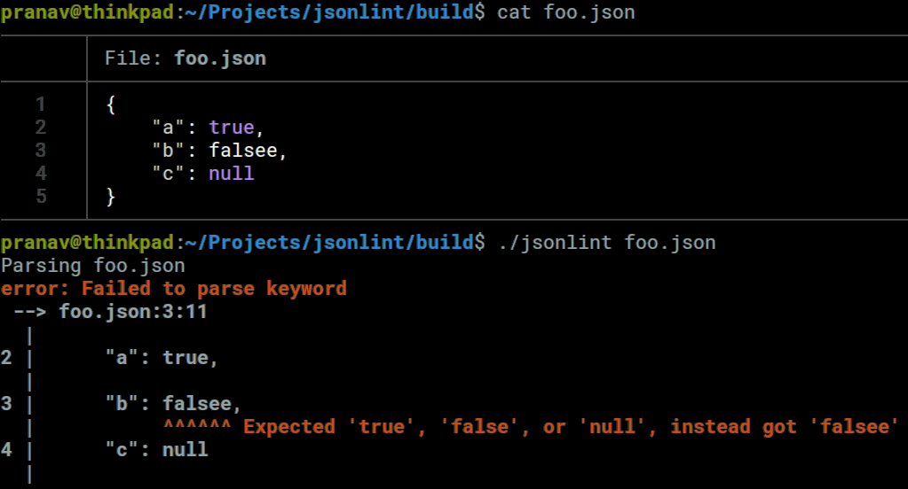

<p align="center">
  
</p>

`jsonlint` is a lightweight command-line tool for validating JSON.

## Building `jsonlint`

```bash
$ git clone https://github.com/p-ranav/jsonlint.git
$ cd jsonlint
$ mkdir build && cd build
$ cmake .. && make && make check
```

## Usage

```bash
$ ./jsonlint --help
Usage: jsonlint [options] file 

Positional arguments:
file      	json file to validate

Optional arguments:
-h --help 	show this help message and exit
```

## Example Scenarios

### Unterminated String



### Trailing comma in array



### Duplicate key in object



### Typo in keyword


